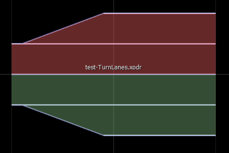

There are 4 variations of turn lanes:

# 1. Turn lanes at the end of a side:

# 2. Turn lanes at the beginning of a side and merge lanes at the beginning on the other side

# 3. Turn lanes at the beginning of a side and no merge lanes at the beginning on the other side
