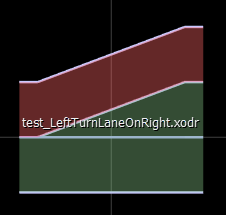
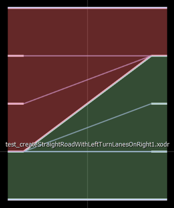
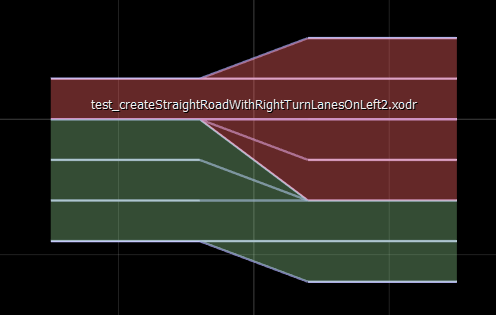
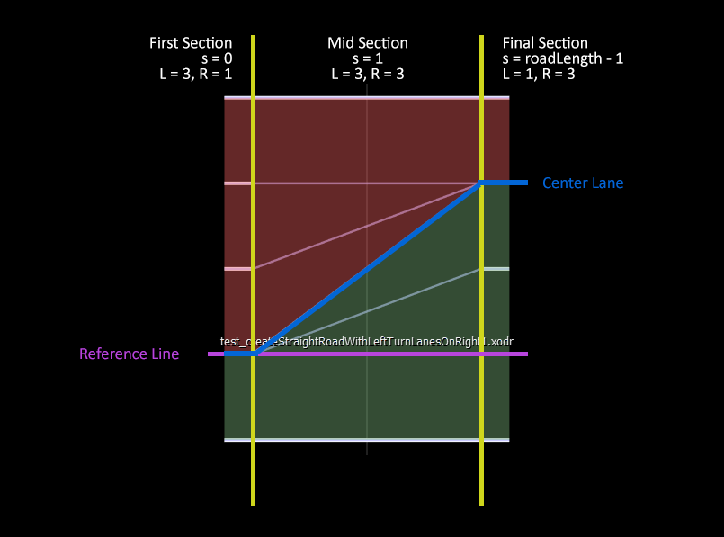

# Turn and Merge Lanes:

# Usage
There are 3 variations of turn lanes:

### 1. Turn lanes at the end of a side:

method: **StraightRoadBuilder::create**

example:

    StraightRoadBuilder::create(0, length = 10, 
                                            laneSides=LaneSides.RIGHT,
                                            isLeftTurnLane=True)

### 2. Turn lanes at the beginning of a side and merge lanes at the beginning on the other side

method: **StraightRoadBuilder::create** 
example: 

    StraightRoadBuilder::create(0, laneSides=LaneSides.RIGHT, isLeftTurnLane=True)
    StraightRoadBuilder::create(0, laneSides=LaneSides.LEFT, isRighttTurnLane=True)

###  3. Turn lanes at the beginning of a side and no merge lanes at the beginning on the other side
method: **StraightRoadBuilder::createWithRighttTurnLanesOnLeft**

method: **StraightRoadBuilder::createWithLeftTurnLanesOnRight**

example:

    StraightRoadBuilder::createWithLeftTurnLanesOnRight(1, length = 10, n_lanes=1, 
                                                                    isLeftTurnLane=True, 
                                                                    isRightTurnLane=True,
                                                                    numberOfLeftTurnLanesOnRight=2))

    StraightRoadBuilder::createWithRightTurnLanesOnLeft(1, length = 10, n_lanes=1, 
                                                                    isLeftTurnLane=True, 
                                                                    isRightTurnLane=True,
                                                                    numberOfRightTurnLanesOnLeft=2))

Similarly, merge lanes have similar structures. Merge lanes at the beginning of a side is only used in case of turn lanes at the beginning of a side to make space for the turns.

 
 

# Architecture

## 3 Lane Sections

To create turn lanes we create 3 consecutive lane sections starting at s=0. s=1, s=roadLength-1.

In case of turn lanes, the first section does not have the turn lane, the mid section has the curve, and the final section has a straight lane.

In case of merge lanes, the first section has straight lanes, mid has the curves, the final section does not have the merge lanes.

So, for on turn lane in a side with an existing lane, the first section will have 1 lane, mid section will have 2, final will have 2.

**only mid section has a curve**

This simplifies a lot of calculations for consecutive roads, road signs, etc.

## Lane Offset Calculations:

For turn lanes at *only the beginning* of a side, the center lane is shifted up or down from the reference line (Which have the same effect has reference lines shifted down or up). Special functions available in RoadLinker to adjust laneOffsets of sucessor roads.

