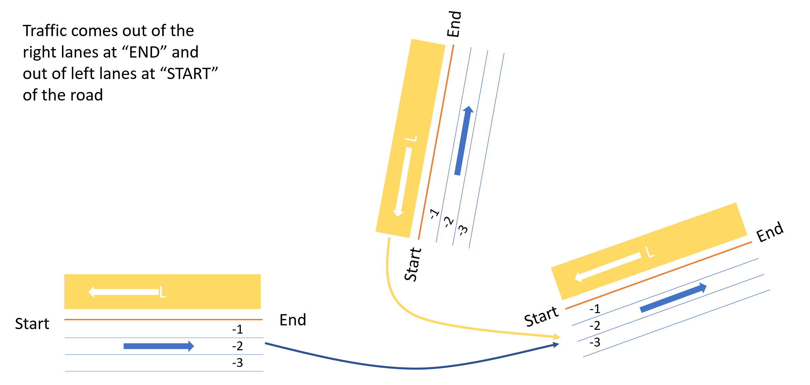
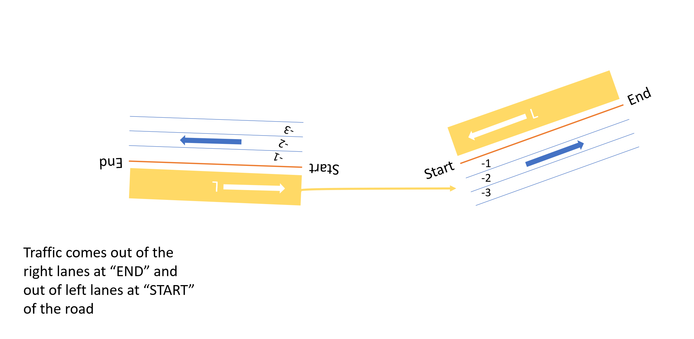

:orphan:
# Lane Linker

## Background:

Right lanes and left lanes in a road are relative to the start and endpoints of the road. This is not the same in a driver's point of view. When two roads are connected, it's important to consider their contact points. Check the following figures:

It's important to note that, when two roads have the **same contact point** (start-start or end-end), left lanes are to be linked with right lanes, and vice versa. In case of the **different contact points** (start-end or end-start), left lanes are to be linked with left lanes and right lanes with right lanes.

The lane linker class considers this concept and currently implemented for pairs where one is a connection road.
