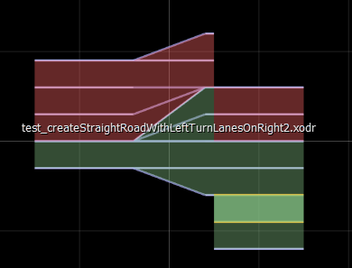
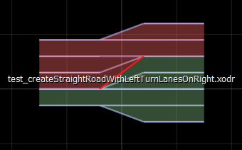

# Road Linker

This class does operations associated with successor-predecessor relationships. 

Use-case #1: Adjusting laneOffsets of roads in case of both having different laneOffset at the contact point lane sections:

Method: **adjustLaneOffsetsForOdr**

This method is necessary to align reference lines, because roads are joined by the position of reference lines. When we shift the center lane up, we are in effect shifting the reference line down. So, at contact points laneOffset of sucessors needs to be set to the laneOffset of the last section of the predecessor.

**odr creators in extensions calls this function by default.**

Example: Lane Offset Adjusted, and Not adjust for the last road on the right:

The last road in the former picture  has the center lane on the reference line. So, when the roads were joined, the center lanes did not connect to the center lane of the previous road. The previous road (with beautiful turns) has center lane shifted two lanes up.

This one was adjusted by the Road linker.

Use-case #2: Linking roads with no branches (sequentially generated roads)

Method: **linkConsecutiveRoadsWithNoBranches**

The ordering of roads inside the input list determines the predecessor and successor relationships.