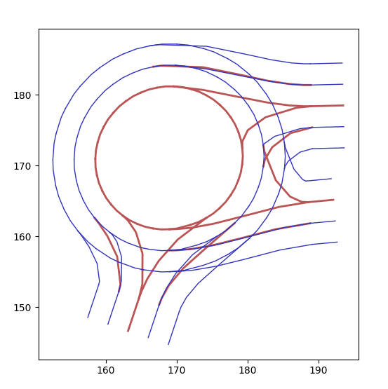

Welcome to JunctionArt's documentation!
=======================================

This documentation website is still under construction. Please post an issue on our github repository if you cannot install it or use it correctly. 
https://github.com/AugmentedDesignLab/junction-art

With JunctionArt, you can create complete city maps, interesting intersections and roundabouts. Here are some examples:

1. Road Generator
#################

.. image:: images/examples/another-road.PNG
   :width: 600
   :align: center

2. Intersection Generator
#################

Four-way intersections:

|4-way-1| |4-way-2| |4-way-3|

Varying way intersections:

|5-way| |6-way| |7-way|

.. |7-way| image:: images/examples/7-way-new-2.PNG
   :width: 30%

3. Roundabout Generator
######################

|classic-1| |classic-2| |classic-3|

.. toctree::
   :numbered:
   :maxdepth: 2
   :caption: Contents:

   installation.md
   user-guide.md
   dev-guide.md

Indices and tables
==================

* :ref:`genindex`
* :ref:`modindex`
* :ref:`search`
